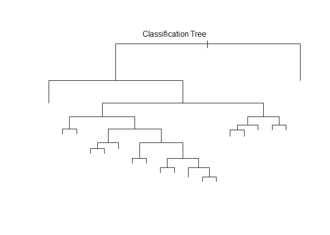
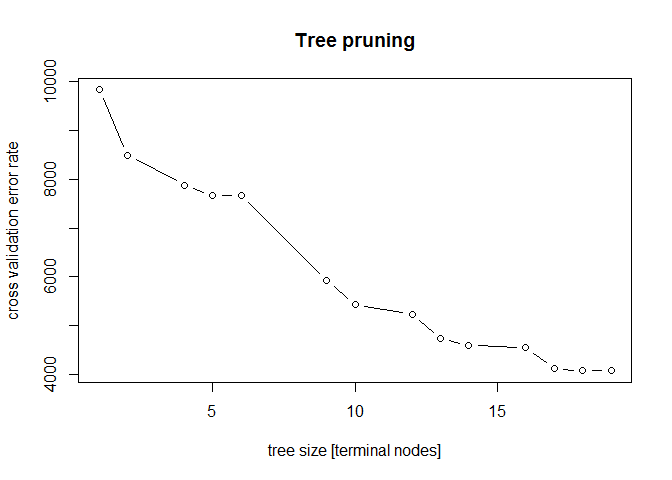

### Background

Using devices such as Jawbone Up, Nike FuelBand, and Fitbit it is now possible to collect a large amount of data about personal activity relatively inexpensively. These type of devices are part of the quantified self movement - a group of enthusiasts who take measurements about themselves regularly to improve their health, to find patterns in their behavior, or because they are tech geeks. One thing that people regularly do is quantify how much of a particular activity they do, but they rarely quantify how well they do it. In this project, your goal will be to use data from accelerometers on the belt, forearm, arm, and dumbell of 6 participants. They were asked to perform barbell lifts correctly and incorrectly in 5 different ways.

### Data Set Acquisition

To start with, the training and the testing data sets, as defined by the assignment were downloaded to the working directory. Additional libraries were also loaded (caret, tree).

    ## Warning: package 'caret' was built under R version 3.1.2

    ## Loading required package: lattice
    ## Loading required package: ggplot2

    ## Warning: package 'tree' was built under R version 3.1.2

### Preparation of Clean Data Set

Exploratory analysis reviled that both data sets are burdened by high fraction of missing (NA) data. For instance, the training data set soncsist of 19622 observations of 160 variables, while there are only 406 complete cases (i.e. 2.0691061 %).

The training data set was then processed in the following manner: all the variables (columns) with any missing values were dropped, leaving a total of 93 variables. Continuing with exploratory analysis, it was noted that certain types of variables contain entries like "\#DIV/0!" or empty entries "". All of those were factor variables. Furthermore, it was determined that the only informative factor column is "classe" (e.g. "user\_name" and "timestamp" should not be considered informative in the present context). Therefore, only numeric on integer columns were kept for furhter analysis.

The resulting data frame (based on the original training data set) had 19622 rows and 54 columns.

### Cross Validation

Having the number of observations in the data set in mind, it was decided to "sacrifice" some of them and create an "internal" testing set, which will be used to assess the preformance of the classification algorithm, prior to the submission of the final result. The internal testing set consided of 30% of randomly assigned observations. The seed was set to 1, to enable reproducibility. The remaining part of the original training set will be refered to as the final trainig set.

To summarise, the classifier will be build on the set with 13737 observations, while the performance will be assessed on the set with 5885 observations.

### Classifying by Classification Tree

For this exercise, classification tree (with tree package) was chosen as the algorithm. The model built with the "classe" as response variable (=barbell lifts) and all the other variables in the final training set as predictors. The figure below shows the resulting classifiaction tree (labels not show for simplicity, due to high number of terminal nodes).

Next, the performance of the tree was assessed by using the internal testing set (confusion matrix below).

    ## Confusion Matrix and Statistics
    ## 
    ##           Reference
    ## Prediction    A    B    C    D    E
    ##          A 1429  115    8   17   37
    ##          B   75  726  131   91  249
    ##          C   12   50  765  224   65
    ##          D  132  248  122  632  248
    ##          E   26    0    0    0  483
    ## 
    ## Overall Statistics
    ##                                           
    ##                Accuracy : 0.6856          
    ##                  95% CI : (0.6736, 0.6975)
    ##     No Information Rate : 0.2845          
    ##     P-Value [Acc > NIR] : < 2.2e-16       
    ##                                           
    ##                   Kappa : 0.6036          
    ##  Mcnemar's Test P-Value : < 2.2e-16       
    ## 
    ## Statistics by Class:
    ## 
    ##                      Class: A Class: B Class: C Class: D Class: E
    ## Sensitivity            0.8536   0.6374   0.7456   0.6556  0.44640
    ## Specificity            0.9580   0.8850   0.9278   0.8476  0.99459
    ## Pos Pred Value         0.8898   0.5708   0.6855   0.4573  0.94892
    ## Neg Pred Value         0.9427   0.9105   0.9453   0.9263  0.88858
    ## Prevalence             0.2845   0.1935   0.1743   0.1638  0.18386
    ## Detection Rate         0.2428   0.1234   0.1300   0.1074  0.08207
    ## Detection Prevalence   0.2729   0.2161   0.1896   0.2348  0.08649
    ## Balanced Accuracy      0.9058   0.7612   0.8367   0.7516  0.72049

The accuracy calculated on the basis of a confusion matrix turned out to be modest, i.e. 68.56 %, albeit still better than predicting by chance (25% in the current example).

### Tree Pruning

Next, tree pruning was considered as a method to improve results. The chozen function was cv.tree(), which uses cross-validation to determine the optimal complexity. Moreover, the argument FUN=prune.misclass was passed to the function, to guide the cross-validation and pruning process by the classification error rate. The seed was set to 2. 

By evaluating the tree prune plot (above), it seems that the tree with 12 nodes might be a compromise between the size and the accuracy. However, assessment with the internal test set reviled accuracy of 63.38 %. Although the number of terminal nodes was reduced from 22 (original tree) to 15 (after pruning), the loss of accuracy seems to hight.

Therefore, the initial tree will be used for the final grading of the assignment.

### Acknowledgement

The data for this project come from this source: <http://groupware.les.inf.puc-rio.br/har>.
